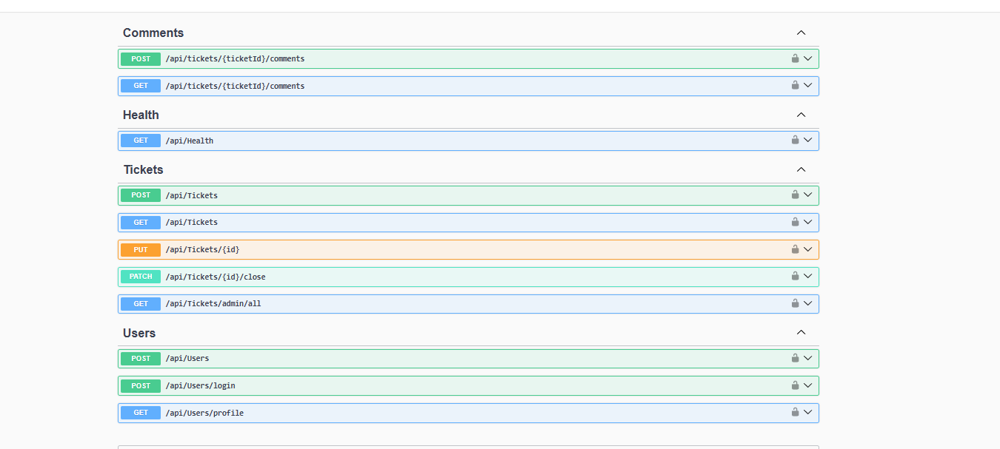
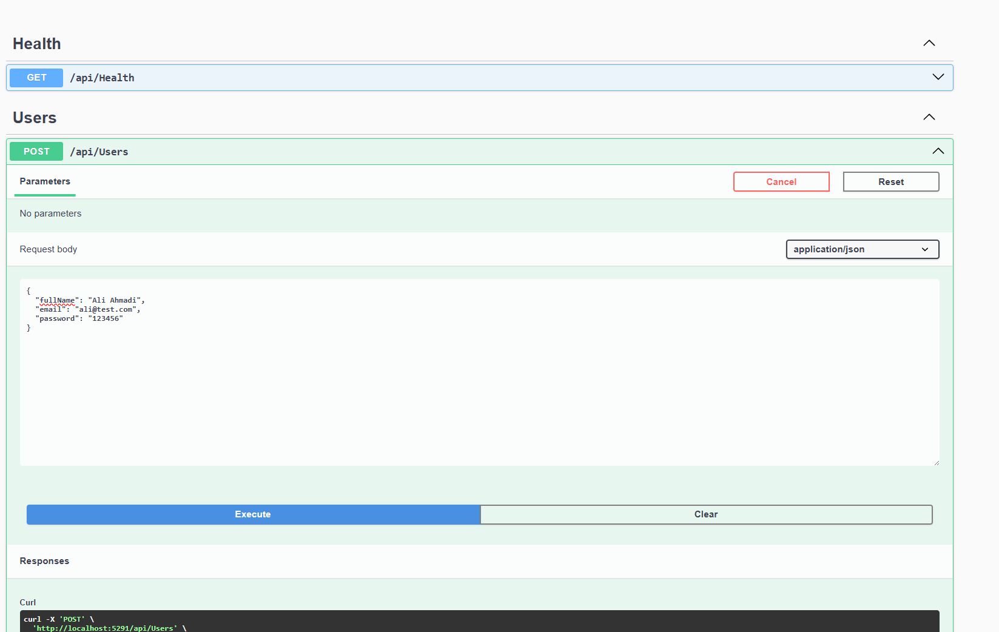
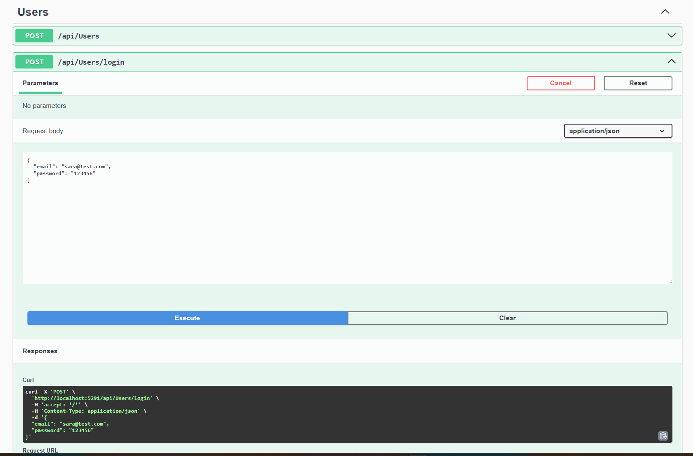
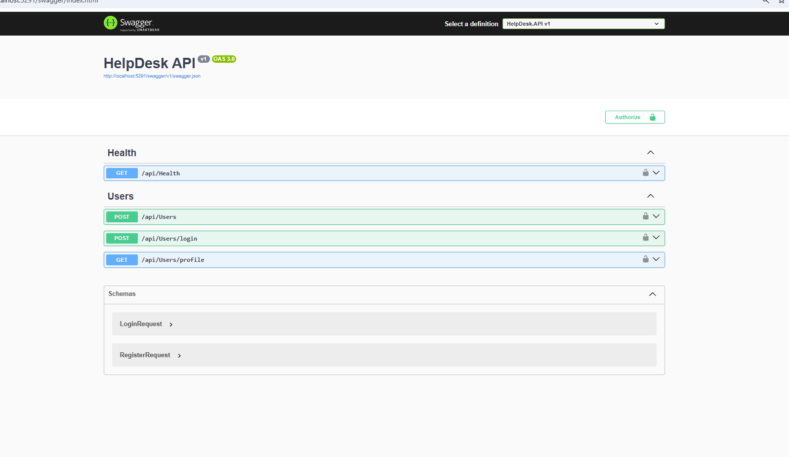
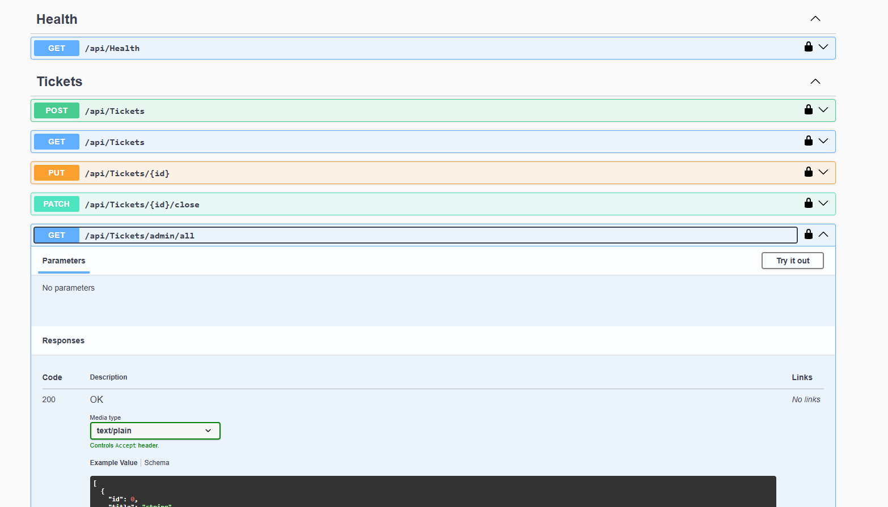

# 🎫 HelpDesk Ticket System API

<p align="center">


</p>

<p align="center">
A backend HelpDesk Ticket Management System built with ASP.NET Core 8 Web API.<br>
Includes secure authentication, role-based authorization, ticket management and ticket comments.
</p>

---

# ✨ Features

## Authentication & Security

- ✅ User Registration
- ✅ Secure Password Hashing with BCrypt
- ✅ User Login
- ✅ JWT Authentication
- ✅ Protected API Endpoints
- ✅ Swagger JWT Authorization
- ✅ Role-Based Authorization
- ✅ User and Admin Roles

## Ticket Management

- ✅ Create Tickets
- ✅ Get User Tickets
- ✅ Update Tickets
- ✅ Close Tickets
- ✅ Ticket Status
- ✅ Ticket Priority
- ✅ User-Ticket Relationship
- ✅ Admin Access to All Tickets

## Ticket Comments

- ✅ Add Comments to Tickets
- ✅ Get Ticket Comments
- ✅ User-Comment Relationship
- ✅ Ticket-Comment Relationship
- ✅ Authorized User/Admin Access

## Backend & Database

- ✅ Entity Framework Core
- ✅ SQL Server
- ✅ EF Core Migrations
- ✅ Dockerized SQL Server
- ✅ Health Check API
- ✅ Swagger / OpenAPI

---

# 🛠 Tech Stack

| Category             | Technologies               |
| -------------------- | -------------------------- |
| Backend              | ASP.NET Core 8 Web API, C# |
| Database             | SQL Server                 |
| ORM                  | Entity Framework Core 8    |
| Authentication       | JWT Bearer Authentication  |
| Authorization        | Role-Based Authorization   |
| Security             | BCrypt                     |
| API Documentation    | Swagger / OpenAPI          |
| Database Environment | Docker                     |
| Version Control      | Git / GitHub               |

---

# 🏗 Project Structure

```text
HelpDesk.API
│
├── Controllers
│   ├── UsersController.cs
│   ├── TicketsController.cs
│   ├── CommentsController.cs
│   └── HealthController.cs
│
├── Data
│   └── ApplicationDbContext.cs
│
├── DTOs
│   └── Comments
│
├── Models
│   ├── User.cs
│   ├── Ticket.cs
│   └── TicketComment.cs
│
├── Services
│   └── JwtService.cs
│
└── Migrations
```

---

# 🔐 Authentication

Users authenticate using JWT Bearer Authentication.

After successful login, the API generates a JWT containing the user's identity and role.

Protected endpoints require:

```text
Authorization: Bearer YOUR_JWT_TOKEN
```

Two roles are currently supported:

```text
User
Admin
```

Admin-only endpoints use role-based authorization.

---

# 📌 API Endpoints

## Users

| Method | Endpoint             | Description                |
| ------ | -------------------- | -------------------------- |
| POST   | `/api/Users`         | Register user              |
| POST   | `/api/Users/login`   | Login and generate JWT     |
| GET    | `/api/Users/profile` | Get protected user profile |

## Tickets

| Method | Endpoint                  | Description                |
| ------ | ------------------------- | -------------------------- |
| POST   | `/api/Tickets`            | Create ticket              |
| GET    | `/api/Tickets`            | Get current user's tickets |
| PUT    | `/api/Tickets/{id}`       | Update ticket              |
| PATCH  | `/api/Tickets/{id}/close` | Close ticket               |
| GET    | `/api/Tickets/admin/all`  | Get all tickets as Admin   |

## Comments

| Method | Endpoint                           | Description           |
| ------ | ---------------------------------- | --------------------- |
| POST   | `/api/tickets/{ticketId}/comments` | Add comment to ticket |
| GET    | `/api/tickets/{ticketId}/comments` | Get ticket comments   |

## Health

| Method | Endpoint      | Description      |
| ------ | ------------- | ---------------- |
| GET    | `/api/Health` | API health check |

---

# 🔗 Data Relationships

```text
User
 ├── Tickets
 └── Comments

Ticket
 ├── User
 └── Comments

TicketComment
 ├── User
 └── Ticket
```

Each ticket belongs to a user.

Each comment belongs to both a ticket and a user.

Admins can access tickets beyond their own through protected Admin endpoints.

---

# 📷 Project Preview

## Swagger API

<p align="center">

</p>

## Health Check

<p align="center">

</p>

## User Registration

<p align="center">

</p>

## Login

<p align="center">

</p>

## JWT Protected Endpoint

<p align="center">

</p>

## Admin Ticket Access

<p align="center">

</p>

---

# 🚀 Getting Started

## 1. Clone the repository

```bash
git clone https://github.com/Minoo-YH/HelpDeskTicketSystem.git
cd HelpDeskTicketSystem/HelpDesk.API
```

## 2. Restore dependencies

```bash
dotnet restore
```

## 3. Configure the database

Set the SQL Server connection string in:

```text
appsettings.json
```

## 4. Apply migrations

```bash
dotnet ef database update
```

## 5. Run the API

```bash
dotnet run
```

Open Swagger using the local URL shown by ASP.NET Core.

---

# 🤖 AI & Automation — Next Phase

The next phase of this project will integrate n8n and AI automation with the HelpDesk API.

Planned workflow:

```text
New Ticket
    ↓
HelpDesk API
    ↓
n8n Webhook
    ↓
AI Analysis
    ↓
Category Detection
    ↓
Priority Classification
    ↓
Suggested Response
    ↓
Save AI Result
```

This phase will demonstrate practical experience with:

- n8n
- AI-powered workflow automation
- REST APIs
- Webhooks
- JSON data processing
- Automated ticket classification
- AI-generated response suggestions

---

# 📅 Roadmap

- ✅ Authentication
- ✅ JWT Authorization
- ✅ SQL Server / EF Core
- ✅ Ticket Management
- ✅ User / Admin Roles
- ✅ Ticket Comments
- 🚧 AI Ticket Analysis
- 🚧 n8n Workflow Automation
- ⏳ AI Suggested Responses
- ⏳ Deployment

---

# 👩‍💻 Author

### Minoo YH

GitHub: Minoo-YH

---

## ⭐ Support

If you find this project useful, consider giving the repository a ⭐.
